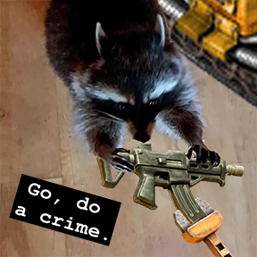

# give-me-back-my-machine-gun-dammit
 
 This mod for Factorio checks if the tank prototype has a machine gun and a flamethrower and adds them back if they are missing. You can find the mod on the Factorio mod portal at the following link: https://mods.factorio.com/mod/give-me-back-my-machine-gun-dammit
